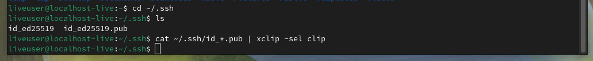

---
## Front matter

title: "**Отчет по лабораторной работе №2**"
subtitle: "_дисциплина: Архитектура компьютера_"
author: "Сергеев Даниил Олегович"

## Generic otions
lang: ru-RU
toc-title: "Содержание"

## Bibliography
bibliography: bib/cite.bib
csl: pandoc/csl/gost-r-7-0-5-2008-numeric.csl

## Pdf output format
toc: true # Table of contents
toc-depth: 2
lof: true # List of figures
lot: false # List of tables
fontsize: 13pt
linestretch: 1.5
papersize: a4
documentclass: scrreprt
## I18n polyglossia
polyglossia-lang:
  name: russian
  options:
	- spelling=modern
	- babelshorthands=true
polyglossia-otherlangs:
  name: english
## I18n babel
babel-lang: russian
babel-otherlangs: english
## Fonts
mainfont: IBM Plex Serif
romanfont: IBM Plex Serif
sansfont: IBM Plex Sans
monofont: IBM Plex Mono
mathfont: STIX Two Math
mainfontoptions: Ligatures=Common,Ligatures=TeX,Scale=0.94
romanfontoptions: Ligatures=Common,Ligatures=TeX,Scale=0.94
sansfontoptions: Ligatures=Common,Ligatures=TeX,Scale=MatchLowercase,Scale=0.94
monofontoptions: Scale=MatchLowercase,Scale=0.94,FakeStretch=0.9
mathfontoptions:
## Biblatex
biblatex: true
biblio-style: "gost-numeric"
biblatexoptions:
  - parentracker=true
  - backend=biber
  - hyperref=auto
  - language=auto
  - autolang=other*
  - citestyle=gost-numeric
## Pandoc-crossref LaTeX customization
figureTitle: "Рис."
tableTitle: "Таблица"
listingTitle: "Листинг"
lofTitle: "Список иллюстраций"
lotTitle: "Список таблиц"
lolTitle: "Листинги"
## Misc options
indent: true
header-includes:
  - \usepackage{indentfirst}
  - \usepackage{float} # keep figures where there are in the text
  - \floatplacement{figure}{H} # keep figures where there are in the text
---

# Цель лабораторной работы

Целью работы является изучить идеологию и применение средств контроля версий. Приобрести практические навыки по работе с системой git.

# Ход выполнения лабораторной работы

## Настройка github

Описание задания: Создайте учётную запись на сайте <https://github.com/> и заполните основные данные.

{#fig:001 width=85%} 

Так как у меня уже существует учётная запись в git, вхожу в существующую учётную запись.

## Базовая настройка git

Описание задания: Задайте начальную конфигурацию git с помощью терминала.

{#fig:002 width=85%} 

Делаем предварительную конфигурацию git с помощью указанных команд.

## Создание SSH ключа

Описание задания: Создайте SSH ключ для последующей идентификации пользователя на сервере репозиториев и загрузите его в git.

{#fig:003 width=85%} 

Генерируем пару ключей (приватный и открытый) в каталоге ~/.ssh с помощью заданной команды.

{#fig:004 width=85%} 

Копируем сгенерированный ключ с помощью команды xclip в буфер обмена.

{#fig:005 width=85%} 

{#fig:006 width=85%} 

{#fig:007 width=85%} 

## Создание рабочего пространства и репозитория курса на основе шаблона

Описание задания: Откройте терминал и создайте каталог для предмета «Архитектура компьютера».

{#fig:008 width=85%} 

Создаём каталоги /work/study/2024-2025/«Архитектура компьютера» и проверяем их наличие.

## Создание репозитория курса на основе шаблона

Описание задания: Создайте репозиторий курса на основе шаблона и клонируйте его в ранее созданный каталог.

{#fig:009 width=85%} 

{#fig:010 width=85%} 

{#fig:011 width=85%} 

Клонируем созданный репозиторий в каталог arch-pc, находящийся в каталоге курса, с помощью заданной команды и проверяем наличие файлов.

## Настройка каталога курса

Описание задания: Перейдите в каталог курса,удалите лишние файлы, создайте необходимые каталоги и отправьте изменённые файлы на сервер.

{#fig:012 width=85%} 

Настраиваем каталог курса: удаляем лишний файл package.json, создаём необходимые каталоге (labs/lab01, labs/lab02 и др.). С помощью команд git add . , git commit -am и git push сохраняем и подтверждаем изменения с последующей отправкой файлов на сервер.

{#fig:013 width=85%} 

# Ход выполнения заданий для самостоятельной работы

## Задание №1

Описание задания: Создайте отчет по выполнению лабораторной работы в соответствующей папке рабочего пространства, скопируйте отчеты по выполнению предыдущих лабораторных работ в соответсвующие каталоги созданного рабочего пространства и загрузите файлы на github.

{#fig:014 width=85%} 

Скачиваем отчеты по выполнению лабораторных работ, перемещаем файл лабораторной работы №2 в каталог labs/lab02.

Копируем файл лабораторной работы №1 в каталог labs/lab01, после чего проверяем наличие изменений с помощью команды ls и загружаем обновление на сервер.

{#fig:015 width=85%} 

# Вывод

После выполнения лабораторной работы и заданий для самостоятельной работы я изучил, как применять средство для контроля версий git, и приобрел практические навыки по работе с ним. Я научился настраивать github, создавать новые репозитории, загружать файлы с репозитория и отправлять изменения на сервер.
