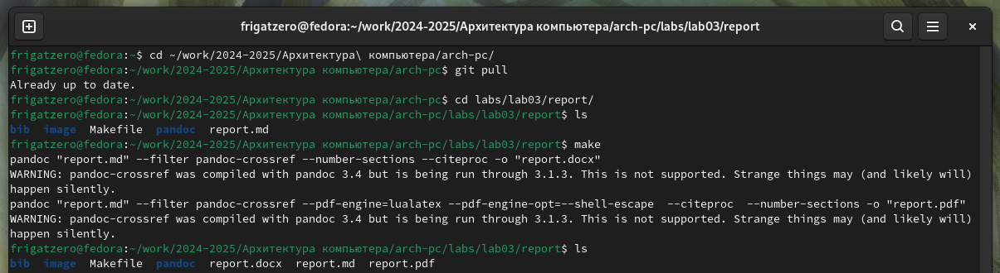
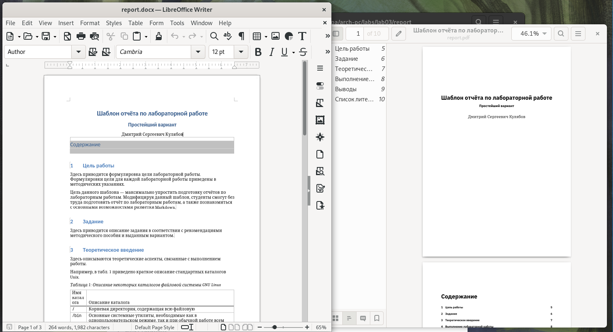
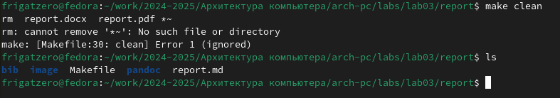
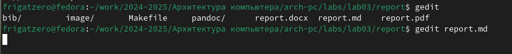
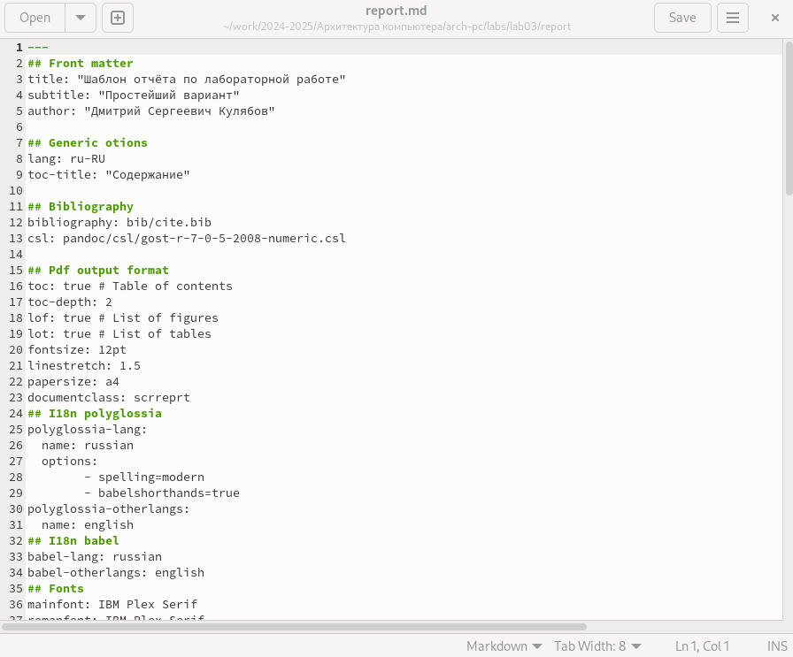
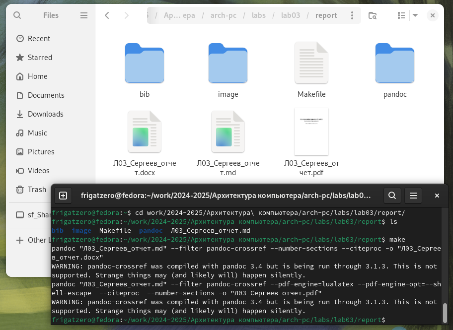
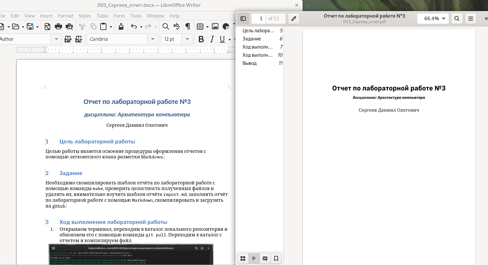

---
## Front matter

title: "**Отчет по лабораторной работе №2**"
subtitle: "_дисциплина: Архитектура компьютера_"
author: "Сергеев Даниил Олегович"


## Generic otions
lang: ru-RU
toc-title: "Содержание"

## Bibliography
bibliography: bib/cite.bib
csl: pandoc/csl/gost-r-7-0-5-2008-numeric.csl

## Pdf output format
toc: true # Table of contents
toc-depth: 2
lof: true # List of figures
lot: true # List of tables
fontsize: 12pt
linestretch: 1.5
papersize: a4
documentclass: scrreprt
## I18n polyglossia
polyglossia-lang:
  name: russian
  options:
	- spelling=modern
	- babelshorthands=true
polyglossia-otherlangs:
  name: english
## I18n babel
babel-lang: russian
babel-otherlangs: english
## Fonts
mainfont: IBM Plex Serif
romanfont: IBM Plex Serif
sansfont: IBM Plex Sans
monofont: IBM Plex Mono
mathfont: STIX Two Math
mainfontoptions: Ligatures=Common,Ligatures=TeX,Scale=0.94
romanfontoptions: Ligatures=Common,Ligatures=TeX,Scale=0.94
sansfontoptions: Ligatures=Common,Ligatures=TeX,Scale=MatchLowercase,Scale=0.94
monofontoptions: Scale=MatchLowercase,Scale=0.94,FakeStretch=0.9
mathfontoptions:
## Biblatex
biblatex: true
biblio-style: "gost-numeric"
biblatexoptions:
  - parentracker=true
  - backend=biber
  - hyperref=auto
  - language=auto
  - autolang=other*
  - citestyle=gost-numeric
## Pandoc-crossref LaTeX customization
figureTitle: "Рис."
tableTitle: "Таблица"
listingTitle: "Листинг"
lofTitle: "Список иллюстраций"
lotTitle: "Список таблиц"
lolTitle: "Листинги"
## Misc options
indent: true
header-includes:
  - \usepackage{indentfirst}
  - \usepackage{float} # keep figures where there are in the text
  - \floatplacement{figure}{H} # keep figures where there are in the text
---

# Цель лабораторной работы

Целью работы является освоение процедуры оформления отчетов с помощью легковесного языка разметки Markdown.

# Задание

Необходимо скомпилировать шаблон отчёта по лабораторной работе с помощью команды ``` make ```, проверить целостность полученных файлов и удалить их, внимательно изучить шаблон отчёта ``` report.md ```, заполнить отчёт по лабораторной работе с помощью ``` Markdown ```, скомпилировать и загрузить на github.


Более подробно про Unix см. в [@tanenbaum_book_modern-os_ru; @robbins_book_bash_en; @zarrelli_book_mastering-bash_en; @newham_book_learning-bash_en].

# Ход выполнения лабораторной работы

1. Открываем терминал, переходим в каталог локального репозитория и обновляем его с помощью команды ``` git pull ```. Переходим в каталог с отчетом и компилируем файл.

{#fig:001 width=85%}

2. Открываем полученные файлы и проверяем.

{#fig:002 width=85%}

3. Удаляем файлы с помощью команды ``` make clean ``` и проверяем.

{#fig:003 width=85%}

4. Открываем ``` report.md ``` с помощью gedit

{#fig:004 width=85%}

{#fig:005 width=85%}

5. Заполненный отчет по лабораторной работе компилируем с использованием ``` Makefile ```.

{#fig:006 width=85%}

6. Проверяем корректность созданных отчетов

{#fig:007 width=85%}

7. Загружаем созданные файлы на github

# Ход выполнения заданий для самостоятельной работы

# Вывод

Здесь кратко описываются итоги проделанной работы.


