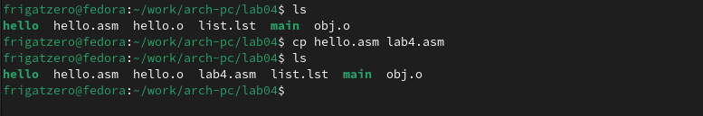
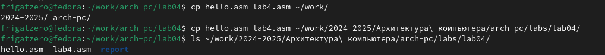
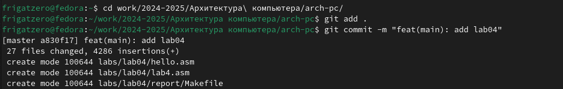

---
## Front matter

title: "**Отчет по лабораторной работе №4**"
subtitle: "_дисциплина: Архитектура компьютера_"
author: "Сергеев Даниил Олегович"


## Generic otions
lang: ru-RU
toc-title: "Содержание"

## Bibliography
bibliography: bib/cite.bib
csl: pandoc/csl/gost-r-7-0-5-2008-numeric.csl

## Pdf output format
toc: true # Table of contents
toc-depth: 2
lof: true # List of figures
lot: false # List of tables
fontsize: 13pt
linestretch: 1.5
papersize: a4
documentclass: scrreprt
## I18n polyglossia
polyglossia-lang:
  name: russian
  options:
	- spelling=modern
	- babelshorthands=true
polyglossia-otherlangs:
  name: english
## I18n babel
babel-lang: russian
babel-otherlangs: english
## Fonts
mainfont: IBM Plex Serif
romanfont: IBM Plex Serif
sansfont: IBM Plex Sans
monofont: IBM Plex Mono
mathfont: STIX Two Math
mainfontoptions: Ligatures=Common,Ligatures=TeX,Scale=0.94
romanfontoptions: Ligatures=Common,Ligatures=TeX,Scale=0.94
sansfontoptions: Ligatures=Common,Ligatures=TeX,Scale=MatchLowercase,Scale=0.94
monofontoptions: Scale=MatchLowercase,Scale=0.94,FakeStretch=0.9
mathfontoptions:
## Biblatex
biblatex: true
biblio-style: "gost-numeric"
biblatexoptions:
  - parentracker=true
  - backend=biber
  - hyperref=auto
  - language=auto
  - autolang=other*
  - citestyle=gost-numeric
## Pandoc-crossref LaTeX customization
figureTitle: "Рис."
tableTitle: "Таблица"
listingTitle: "Листинг"
lofTitle: "Список иллюстраций"
lotTitle: "Список таблиц"
lolTitle: "Листинги"
## Misc options
indent: true
header-includes:
  - \usepackage{indentfirst}
  - \usepackage{float} # keep figures where there are in the text
  - \floatplacement{figure}{H} # keep figures where there are in the text
---

# Цель лабораторной работы

Освоение процедуры компиляции и сборки программ, написанных на ассемблере NASM.

# Задание

Необходимо создать файл ``` hello.asm ```, открыть его с помощью текстового редактора и ввести текст из примера. Далее необходимо скомпилировать измененный файл и передать объектный файл на обработку компанировщику, проверить корректность введенных команд и запустить исполняемый файл.

# Ход выполнения лабораторной работы

1. Открываем терминал, создаем каталоги ``` ~/work/arch-pc/lab04 ```, переходим в них. Создаем файл ``` hello.asm ```, проверяем и открываем его с помощью ``` gedit ```.

{#fig:001 width=85%}

2. Вводим текст из примера и сохраняем.

{#fig:002 width=85%}

3. Компилируем файл ``` hello.asm ``` сначала с помощью упрощенной команды ``` nasm -f elf hello.asm ```, а потом с помощью расширенной: ``` nasm -o obj.o -f elf -g -l list.lst hello.asm ```. В результате получим три файла: ``` obj.o ```, ``` hello.o ``` и файл листинга ``` list.lst ```. Компонуем полученные файлы с помощью указанных команд. Во втором случае файл получил имя ``` main ```, его объектный файл назывался ``` obj.o ```.

{#fig:003 width=85%}

4. Запускаем файл.

{#fig:004 width=85%}

# Ход выполнения заданий для самостоятельной работы

5. В текущем каталоге создаем копию файла ``` hello.asm ``` с именем ``` lab4.asm ```.

{#fig:005 width=85%}

6. Открываем файл с помощью ``` gedit ```. Делаем так, чтобы вместо ``` Hello world! ``` на экран выводились фамилия и имя.

{#fig:006 width=85%}

7. Оттранслируем (создаём объектный файл) ``` lab4.asm ```.  

{#fig:007 width=85%}

8. Компонируем файл, используя соответствующее имя, запускаем файл.

{#fig:008 width=85%}

9. Копируем файлы ``` hello.asm ``` и ``` lab4.asm ``` в локальный репозиторий.

{#fig:009 width=85%}

10. Загружаем файлы на github.

{#fig:010 width=85%}

{#fig:011 width=85%}

# Вывод

После выполнения заданий лабораторной работы и заданий для самостоятельной работы я освоил процедуру компиляции и компоновки (сборки) программ, написанных на ассемблере NASM, через командную строку.


