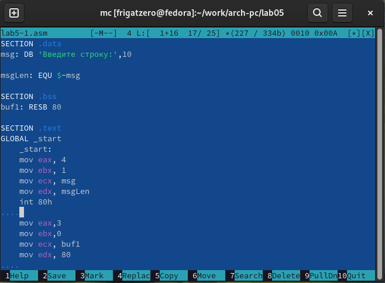
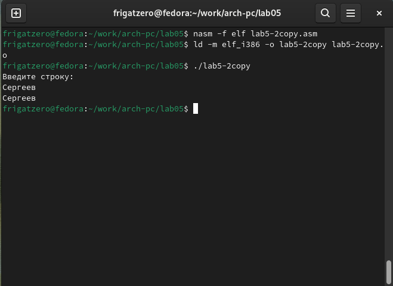

---
## Front matter

title: "**Отчет по лабораторной работе №5**"
subtitle: "_дисциплина: Архитектура компьютера_"
author: "Сергеев Даниил Олегович"

## Generic otions
lang: ru-RU
toc-title: "Содержание"

## Bibliography
bibliography: bib/cite.bib
csl: pandoc/csl/gost-r-7-0-5-2008-numeric.csl

## Pdf output format
toc: true # Table of contents
toc-depth: 2
lof: true # List of figures
lot: false # List of tables
fontsize: 13pt
linestretch: 1.5
papersize: a4
documentclass: scrreprt
## I18n polyglossia
polyglossia-lang:
  name: russian
  options:
	- spelling=modern
	- babelshorthands=true
polyglossia-otherlangs:
  name: english
## I18n babel
babel-lang: russian
babel-otherlangs: english
## Fonts
mainfont: IBM Plex Serif
romanfont: IBM Plex Serif
sansfont: IBM Plex Sans
monofont: IBM Plex Mono
mathfont: STIX Two Math
mainfontoptions: Ligatures=Common,Ligatures=TeX,Scale=0.94
romanfontoptions: Ligatures=Common,Ligatures=TeX,Scale=0.94
sansfontoptions: Ligatures=Common,Ligatures=TeX,Scale=MatchLowercase,Scale=0.94
monofontoptions: Scale=MatchLowercase,Scale=0.94,FakeStretch=0.9
mathfontoptions:
## Biblatex
biblatex: true
biblio-style: "gost-numeric"
biblatexoptions:
  - parentracker=true
  - backend=biber
  - hyperref=auto
  - language=auto
  - autolang=other*
  - citestyle=gost-numeric
## Pandoc-crossref LaTeX customization
figureTitle: "Рис."
tableTitle: "Таблица"
listingTitle: "Листинг"
lofTitle: "Список иллюстраций"
lotTitle: "Список таблиц"
lolTitle: "Листинги"
## Misc options
indent: true
header-includes:
  - \usepackage{indentfirst}
  - \usepackage{float} # keep figures where there are in the text
  - \floatplacement{figure}{H} # keep figures where there are in the text
---

# Цель лабораторной работы

Приобретение практических навыков работы в Midnight Commander. Освоение инструкций
языка ассемблера mov и int.

# Задание

Необходимо открыть Midnight Commander и с помощью него создать файл lab5-1.asm. В полученном файле необходимо ввести программу вывода и записи строки с использованием подпрограмм из файла in_out.asm и без.

# Ход выполнения лабораторной работы

1. Открываем Midnight Commander и создаем папку lab05 в каталоге ~/work/arch-pc.

{#fig:001 width=85%}

{#fig:002 width=85%}

{#fig:003 width=85%}

2. Переходим в папку lab05. С помощью команды touch создаем файл lab5-1.asm. Открываем файл с помощью встроенного редактора mc и вводим текст программы из первого листинга. Сохраняем файл и открываем его для просмотра с помощью клавиши F3.

{#fig:004 width=85%}

{#fig:005 width=85%}

{#fig:006 width=85%}

{#fig:007 width=85%}

3. Оттранслируем текст программы в объектный файл, выполняем его компоновку и запускаем.

{#fig:008 width=85%}

4. Открываем каталог с файлом lab5-1.asm в левом окне и каталог с файлом in_out.asm в правом окне. Копируем скаченный файл в левый каталог с помощью клавиши F5.

{#fig:009 width=85%}

{#fig:010 width=85%}

{#fig:011 width=85%}

5. Создаем копию файла lab5-1.asm с именем lab5-2.asm

{#fig:012 width=85%}

6. Открываем файл lab5-2.asm и исправляем текст программы с использованием подпрограмм из внешнего файла in_out.asm в соответствии с вторым листингом. Создаем исполняемый файл и проверяем.

{#fig:013 width=85%}

{#fig:014 width=85%}

7. В файле lab5-2.asm заменяем подпрограмму sprintLF на sprint, из файла создаем исполняемый файл и проверяем его работу. Как можно заметить, после замены подпрограммы, убрался символ переноса строки, поэтому ввод строки в программу начался сразу после печати сообщения.

{#fig:015 width=85%}

{#fig:016 width=85%}

# Ход выполнения заданий для самостоятельной работы

1. Копируем файл lab5-1.asm в файл lab5-1copy.asm. Изменяем текст программы так, чтобы строка выводилась на экран после записи с клавиатуры. Проверяем работу программы.

{#fig:017 width=85%}

{#fig:018 width=85%}

{#fig:019 width=85%}

2. Копируем файл lab5-2.asm в файл lab5-2copy.asm. Изменяем текст программы так, чтобы строка выводилась на экран после записи с клавиатуры с использованием программ из внешнего файла in_out.asm. Проверяем работу программы.

{#fig:020 width=85%}

{#fig:021 width=85%}

{#fig:022 width=85%}

# Вывод

После выполнения заданий лабораторной работы и заданий для самостоятельной работы я приобрел практические навыки работы в файловом менеджере Midnight Commander и освоил инструкции языка ассемблера mov и int на примере комманд ввода и вывода строк, а также узнал как использовать подпрограммы из других файлов, написанных на языке NASM.

