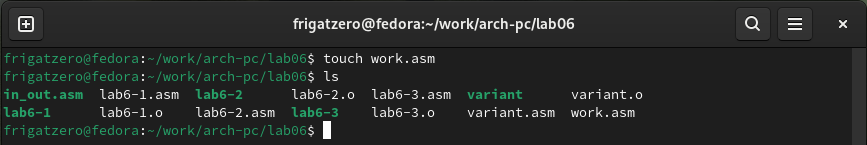

---
## Front matter

title: "**Отчет по лабораторной работе №6**"
subtitle: "_дисциплина: Архитектура компьютера_"
author: "Сергеев Даниил Олегович"


## Generic otions
lang: ru-RU
toc-title: "Содержание"

## Bibliography
bibliography: bib/cite.bib
csl: pandoc/csl/gost-r-7-0-5-2008-numeric.csl

## Pdf output format
toc: true # Table of contents
toc-depth: 2
lof: true # List of figures
lot: false # List of tables
fontsize: 13pt
linestretch: 1.5
papersize: a4
documentclass: scrreprt
## I18n polyglossia
polyglossia-lang:
  name: russian
  options:
	- spelling=modern
	- babelshorthands=true
polyglossia-otherlangs:
  name: english
## I18n babel
babel-lang: russian
babel-otherlangs: english
## Fonts
mainfont: IBM Plex Serif
romanfont: IBM Plex Serif
sansfont: IBM Plex Sans
monofont: IBM Plex Mono
mathfont: STIX Two Math
mainfontoptions: Ligatures=Common,Ligatures=TeX,Scale=0.94
romanfontoptions: Ligatures=Common,Ligatures=TeX,Scale=0.94
sansfontoptions: Ligatures=Common,Ligatures=TeX,Scale=MatchLowercase,Scale=0.94
monofontoptions: Scale=MatchLowercase,Scale=0.94,FakeStretch=0.9
mathfontoptions:
## Biblatex
biblatex: true
biblio-style: "gost-numeric"
biblatexoptions:
  - parentracker=true
  - backend=biber
  - hyperref=auto
  - language=auto
  - autolang=other*
  - citestyle=gost-numeric
## Pandoc-crossref LaTeX customization
figureTitle: "Рис."
tableTitle: "Таблица"
listingTitle: "Листинг"
lofTitle: "Список иллюстраций"
lotTitle: "Список таблиц"
lolTitle: "Листинги"
## Misc options
indent: true
header-includes:
  - \usepackage{indentfirst}
  - \usepackage{float} # keep figures where there are in the text
  - \floatplacement{figure}{H} # keep figures where there are in the text
---

# Цель лабораторной работы

Освоение арифметических инструкций языка ассемблера NASM.

# Ход выполнения лабораторной работы

1. Создаем каталог ~/work/arch-pc/lab06, переходим в него и создаем lab6-1.asm. В файл вводим текст программы из листинга 6.1.

{#fig:001 width=85%}

{#fig:002 width=85%}

2. Создаем исполняемый файл и запускаем его.

{#fig:003 width=85%}

3. Изменяем текст программы. Запишем в регистры числа вместо символов '4' и '6'. Создаем исполняемый файл и запускаем его. В результате работы программы получаем код символа 10, который соответствует символу переноса строки, поэтому мы не видим его при выводе на экран.

{#fig:004 width=85%}

{#fig:005 width=85%}

4. Создаем файл lab6-2.asm и вводим в него текст из листинга 6.2.

{#fig:006 width=85%}

{#fig:007 width=85%}

5. Создаем исполняемый файл lab6-2 и запускаем его.

{#fig:008 width=85%}

6. Аналогично изменяем символы '4' и '6' на числа. Проверяем работу файла. При исполнении программы получаем результат равный 10.

{#fig:009 width=85%}

{#fig:010 width=85%}

7. Заменяем функцию iprintLF на iprint. Создаем исполняемый файл и запускаем его. При исполнении программы также получаем 10, но, так как функция iprint не ставит символ переноса строки, сразу после вывода программы начинается строка ввода.

{#fig:011 width=85%}

{#fig:012 width=85%}

8. Создаем файл lab6-3.asm и вводим в него текст из листинга 6.3.

{#fig:013 width=85%}

{#fig:014 width=85%}

9. Создаем исполняемый файл lab6-3 и запускаем его.

{#fig:015 width=85%}

10. Изменяем текст программы для вычисления выражения f(x) = (4*6 + 2)/5. Создаем исполняемый файл и проверяем его работу.

{#fig:016 width=85%}

{#fig:017 width=85%}

11. Создаем файл variant.asm и вводим в него текст из листинга 6.4.

{#fig:018 width=85%}

{#fig:019 width=85%}

12. Создаем исполняемый файл, проверяем его. Вычисляем номер варианта задания для самостоятельной работы. Результат работы программы и аналитическое решение совпали.

{#fig:020 width=85%}

13. Ответы на вопросы:
 - 1. За вывод сообщения "Ваш вариант:" на экран отвечают строки:
 ```assembly
 mov eax,rem
 call sprint
 ```
 - 2. Данные инструкции используются для записи введенной строки в переменную x.
 - 3. Инструкция call atoi используется для вызова функции, которая преобразовывает ascii-код символа в целое число.
 - 4. За вычисление варианта отвечают строки:
 ```assembly
 xor edx, edx
 mov ebx, 20
 div ebx
 inc edx
 ```
 - 5. Остаток от деления при выполнении инструкции div ebx записывается в регистр edx.
 - 6. Инструкция inc edx используется для увеличения значения указанного регистра на единицу.
 - 7. За вывод на экран результата вычислений отвечают строки:
 ```assembly
 mov eax, edx
 call iprintLF
 ```
 
# Ход выполнения заданий для самостоятельной работы

1. Создаем программу для вычисления выражения №18 из таблицы 6.3. Для этого создаем файл work.asm и в окне mc пишем код программы 

{#fig:021 width=85%}

{#fig:022 width=85%}

**Листинг 4.1** Программа для вычисления выражения y = f(x).
```assembly
%include 'in_out.asm'

SECTION .data
exp: DB 'Программа выводит значение выражения №18 f(x) = 3(x+10)-20. ',0
inp: DB 'Введите x: ',0
ans: DB 'Результат вычислений: ',0

SECTION .bss
x: RESB 80

SECTION .text
    GLOBAL _start
    _start:
    
    mov eax, exp  ; Вывод сообщения exp
    call sprintLF ;
    
    mov eax, inp  ; Вывод сообщения inp
    call sprint   ;
    
    mov ecx, x    ; Записываем символы
    mov edx, 80   ; из ввода в переменную
    call sread    ; (буфер) x
    
    mov eax, x    ; Переводим значение x из
    call atoi     ; кода ascii в число и
                  ; и записываем его в eax 
    
    add eax, 10   ; x + 10
    
    mov ebx, 3    ; 
    mul ebx       ; 3 * (x + 10)
    
    sub eax, 20   ; 3 * (x + 10) - 20
    
    mov edi, eax  ; Сохраняем результат в edi
    
    mov eax, ans  ; Вывод сообщения ans
    call sprint   ;
    
    mov eax, edi  ; Вывод результата сразу
    call iprintLF ; после ans
    
    call quit
```

2. Проверяем работу программы для x равного 1 и 5.

{#fig:023 width=85%}

# Вывод

После выполнения заданий лабораторной работы и заданий для самостоятельной работы я освоил арифмитические инструкции add, sub, mul, div, inc и dec, приобрел опыт в написании собственных программ для вычисления выражений на языке ассемблера NASM.

