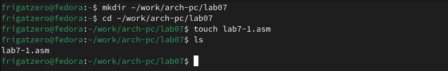

---
## Front matter

title: "**Отчет по лабораторной работе №7**"
subtitle: "_дисциплина: Архитектура компьютера_"
author: "Сергеев Даниил Олегович"


## Generic otions
lang: ru-RU
toc-title: "Содержание"

## Bibliography
bibliography: bib/cite.bib
csl: pandoc/csl/gost-r-7-0-5-2008-numeric.csl

## Pdf output format
toc: true # Table of contents
toc-depth: 2
lof: true # List of figures
lot: false # List of tables
fontsize: 13pt
linestretch: 1.5
papersize: a4
documentclass: scrreprt
## I18n polyglossia
polyglossia-lang:
  name: russian
  options:
	- spelling=modern
	- babelshorthands=true
polyglossia-otherlangs:
  name: english
## I18n babel
babel-lang: russian
babel-otherlangs: english
## Fonts
mainfont: IBM Plex Serif
romanfont: IBM Plex Serif
sansfont: IBM Plex Sans
monofont: IBM Plex Mono
mathfont: STIX Two Math
mainfontoptions: Ligatures=Common,Ligatures=TeX,Scale=0.94
romanfontoptions: Ligatures=Common,Ligatures=TeX,Scale=0.94
sansfontoptions: Ligatures=Common,Ligatures=TeX,Scale=MatchLowercase,Scale=0.94
monofontoptions: Scale=MatchLowercase,Scale=0.94,FakeStretch=0.9
mathfontoptions:
## Biblatex
biblatex: true
biblio-style: "gost-numeric"
biblatexoptions:
  - parentracker=true
  - backend=biber
  - hyperref=auto
  - language=auto
  - autolang=other*
  - citestyle=gost-numeric
## Pandoc-crossref LaTeX customization
figureTitle: "Рис."
tableTitle: "Таблица"
listingTitle: "Листинг"
lofTitle: "Список иллюстраций"
lotTitle: "Список таблиц"
lolTitle: "Листинги"
## Misc options
indent: true
header-includes:
  - \usepackage{indentfirst}
  - \usepackage{float} # keep figures where there are in the text
  - \floatplacement{figure}{H} # keep figures where there are in the text
---

# Цель лабораторной работы

Изучение команд условного и безусловного переходов. Приобретение навыков написания
программ с использованием переходов. Знакомство с назначением и структурой файла
листинга

# Ход выполнения лабораторной работы

1. Создаем каталог для лабораторной работы №7, переходим в него и создаем lab7-1.asm. В файл вводим текст программы из листинга 7.1.

{#fig:001 width=85%}

{#fig:002 width=85%}

2. Создаем исполняемый файл и запускаем его.

{#fig:003 width=85%}

3. Изменим программу так, чтобы она выводила сначала "Сообщение № 2", потом "Сообщение № 1" и завершал работу, в соответсвии с листингом 7.2. Создадим исполняемый файл и проверим его работу.

{#fig:004 width=85%}

{#fig:005 width=85%}

4. Изменим программу, чтобы она выводила сообщения в порядке убывания с 3 по 1.

{#fig:006 width=85%}

{#fig:007 width=85%}

5. Создадим файл lab7-2.asm в том же каталоге, введём код из листинга 7.3. Создадим исполняемый файл и проверим его работу для разных значений B.

{#fig:008 width=85%}

{#fig:009 width=85%}

{#fig:010 width=85%}

6. Создадим файл листинга для программы из файла lab7-2.asm и откроем его с помощью mcedit.

{#fig:011 width=85%}

{#fig:012 width=85%}

7. Для объяснения выберем три строки из файла листинга.

{#fig:013 width=85%}

- 1.Номер строки (20, 21, 22) - это номер строки файла листинга.
- 2.Адрес (000000F2/F7/FC) - это смещение машинного кода от начала текущего сегмента.
- 3.Машинный код (B9[0A000000], BA0A000000, E842FFFFFF) - это исходная строка представленная в виде 16-тиричной последовательности.
- 4.Исходный текст программы (mov ecx, B; mob edx, 10; call sread) - это строка исходной программы.

8. В инструкции mov edx, 10 удалим правый операнд и выполним трансляцию с получением файла листинга. После трансляции, выходит ошибка в файле lab7-2.asm. В выходных файлах мы получили только листинг, объектный файл не создался. В самом же листинге продублировалась строка 21, в которую записалась ошибка.

{#fig:014 width=85%}

{#fig:015 width=85%}
 
# Ход выполнения заданий для самостоятельной работы

1. Напишем программу для нахождения наименьшей из 3 целочисленных переменных a, b и c. Выберем значения переменных из №18, табл. 7.5. Создадим исполняемый файл и проверим его работу

{#fig:016 width=85%}

**Листинг 3.1** Программа для нахождения наименьшей переменной из a, b и c.
```assembly
%include 'in_out.asm'

SECTION .data
fnum db 'Первое число (a): ',0
snum db 'Второе число (b): ',0
tnum db 'Третье число (c): ',0
minn db 'Наименьшее число: ',0

a dd 83
b dd 73
c dd 30

SECTION .bss

min resb 10

SECTION .text
GLOBAL _start
    _start:
	; Выводим значение a
	mov eax, fnum
	call sprint
	mov eax, [a]
	call iprintLF
	; Выводим значение b
	mov eax, snum
	call sprint
	mov eax, [b]
	call iprintLF
	; Выводим значение c
	mov eax, tnum
	call sprint
	mov eax, [c]
	call iprintLF
	; ----------------
	; Сравниваем a и b
	; ----------------
	mov ecx, [a]   ; ecx = a
	mov [min], ecx ; min = ecx(a)
	cmp ecx, [b]   ; a < b
	jl check
	mov ecx, [b]   ; ecx = b
	mov [min], ecx ; min = ecx(b)
    check:
	; ------------------
	; Сравниваем ecx и c
	; ------------------
	cmp ecx, [c]   ; ecx < c
	jl fin
	mov ecx, [c]   ; ecx = c
	mov [min], ecx ; min = ecx(c)
    fin:
	mov eax, minn
	call sprint
	mov eax, [min]
	call iprintLF
	call quit
```

{#fig:017 width=85%}

2. Напишем программу, которая для введенных с клавиатуры значений x и a вычислит значение заданной функции f(x) и выведет результат вычислений. Вид функции возьмем под №18 из табл. 7.6. Проверим её работу с значениями x=1, a=2 и x=2, a=1.

{#fig:018 width=85%}

**Листинг 3.2** Программа для вычисления выражения f(x).
```assembly
%include 'in_out.asm'

SECTION .data

func db 'Задана функция №18',0
fu_1 db 'f(x) = a^2,     a != 1',0
fu_2 db 'f(x) = 10 + x,  a == 1',0
inp_x db 'Введите значение x: ',0
inp_a db 'Введите значение a: ',0
result db 'Результат: ',0

SECTION .bss

x resb 4
a resb 4
f resb 4

SECTION .text
GLOBAL _start
    _start:
	;-[Вывод сообщений func, fu_1, fu_2]
	mov eax, func 
	call sprintLF
	mov eax, fu_1
	call sprintLF
	mov eax, fu_2
	call sprintLF
	;-[Ввод значения x]
	mov eax, inp_x
	call sprint  
	
	mov ecx, x
	mov edx, 10
	call sread
	;-[Преобразование символа x в число]
	mov eax, x
	call atoi
	mov [x], eax
	;-[Ввод значения a]
	mov eax, inp_a
	call sprint
	
	mov ecx, a
	mov edx, 10
	call sread
	;-[Преобразование символа a в число]
	mov eax, a
	call atoi
	mov [a], eax
	; ==============
	; Вычисление f(x)
	; =============
	mov ecx, [a]    ; ecx = a
	cmp ecx, 1      ; Сравниваем ecx и 1
	je if_equal     ; если ecx = 1, то переходим к if_equal
	mov eax, [a]    ; иначе записываем f = a^2
	mov ebx, [a]
	mul ebx         ; eax = a^2
	
	mov [f], eax    ; f = eax
	jmp fin         ; переходим к fin
    if_equal:
	mov ecx, [x]    ; ecx = x
	add ecx, 10     ; ecx = x + 10
	mov [f], ecx    ; f = ecx
	;-[Вывод результата]
    fin:
	mov eax, result
	call sprint
	mov eax, [f]
	call iprintLF
	call quit
```

{#fig:019 width=85%}

# Вывод

После выполнения заданий лабораторной работы и заданий для самостоятельной работы я приобрел навыки написания программ с использованием условных и беусловных переходов, ознакомился с назначением и структурой файла листинга.
