---
## Front matter

title: "**Отчет по лабораторной работе №8**"
subtitle: "_дисциплина: Архитектура компьютера_"
author: "Сергеев Даниил Олегович"


## Generic otions
lang: ru-RU
toc-title: "Содержание"

## Bibliography
bibliography: bib/cite.bib
csl: pandoc/csl/gost-r-7-0-5-2008-numeric.csl

## Pdf output format
toc: true # Table of contents
toc-depth: 2
lof: true # List of figures
lot: false # List of tables
fontsize: 13pt
linestretch: 1.5
papersize: a4
documentclass: scrreprt
## I18n polyglossia
polyglossia-lang:
  name: russian
  options:
	- spelling=modern
	- babelshorthands=true
polyglossia-otherlangs:
  name: english
## I18n babel
babel-lang: russian
babel-otherlangs: english
## Fonts
mainfont: IBM Plex Serif
romanfont: IBM Plex Serif
sansfont: IBM Plex Sans
monofont: IBM Plex Mono
mathfont: STIX Two Math
mainfontoptions: Ligatures=Common,Ligatures=TeX,Scale=0.94
romanfontoptions: Ligatures=Common,Ligatures=TeX,Scale=0.94
sansfontoptions: Ligatures=Common,Ligatures=TeX,Scale=MatchLowercase,Scale=0.94
monofontoptions: Scale=MatchLowercase,Scale=0.94,FakeStretch=0.9
mathfontoptions:
## Biblatex
biblatex: true
biblio-style: "gost-numeric"
biblatexoptions:
  - parentracker=true
  - backend=biber
  - hyperref=auto
  - language=auto
  - autolang=other*
  - citestyle=gost-numeric
## Pandoc-crossref LaTeX customization
figureTitle: "Рис."
tableTitle: "Таблица"
listingTitle: "Листинг"
lofTitle: "Список иллюстраций"
lotTitle: "Список таблиц"
lolTitle: "Листинги"
## Misc options
indent: true
header-includes:
  - \usepackage{indentfirst}
  - \usepackage{float} # keep figures where there are in the text
  - \floatplacement{figure}{H} # keep figures where there are in the text
---

# Цель лабораторной работы

Приобретение навыков написания программ с использованием циклов и обработкой аргументов командной строки.

# Ход выполнения лабораторной работы

1. Создаем каталог для программ лабораторной работы №8. Переходим в него и создаем файл lab8-1.asm.

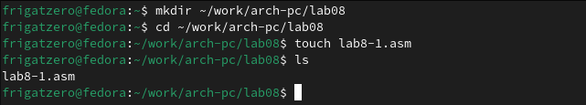{#fig:001 width=85%}

2. Вводим в файл lab8-1.asm код из листинга 8.1, создаем исполняемый файл и проверяем его работу.

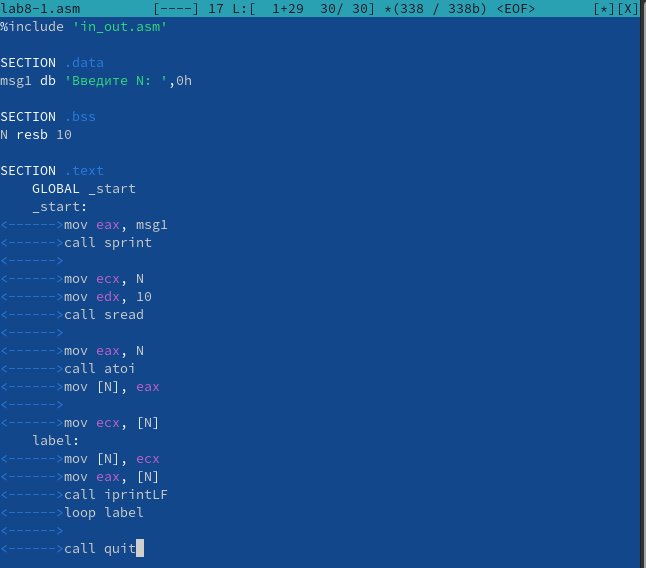{#fig:002 width=85%}

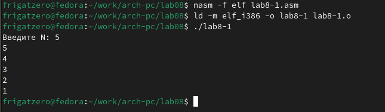{#fig:003 width=85%}

3. Изменяем текст программы так, чтобы значение регистра ecx изменялось в цикле.

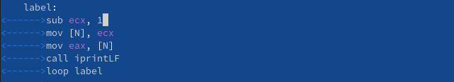{#fig:004 width=85%}

4. Создадим исполняемый файл измененной программы и проверим его работу. При нечетных N, значение ecx доходит до 0 и из него вычитается 1, из-за чего все биты ecx становятся равными 1 и счетчик начинает идти с максимального значения ecx. При четных N, значение ecx доходит до 1 и, после вычитания из него 1, цикл заканчивается, также число проходов цикла становится меньше значения N введенного с клавиатуры.

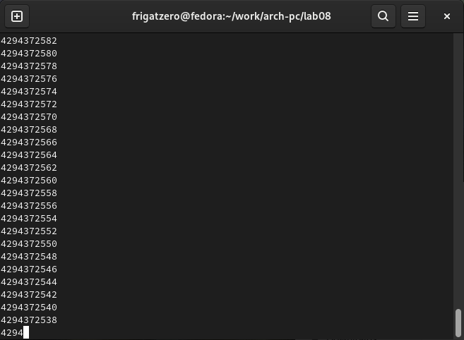{#fig:005 width=85%}

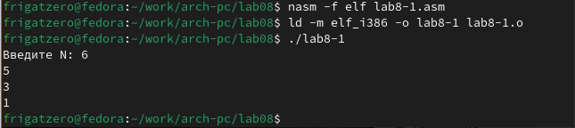{#fig:006 width=85%}

5. Вписываем в программу команды для добавления в стек и извлечения из стека.

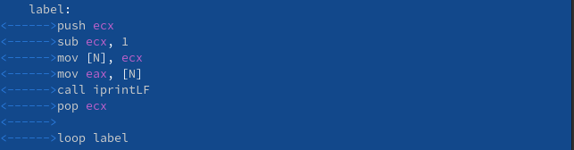{#fig:007 width=85%}

6. Создадим исполняемый файл и проверим его работу. В данном случае число проходов цикла равно введенному при любых значениях N, однако каждый элемент меньше на единицу.

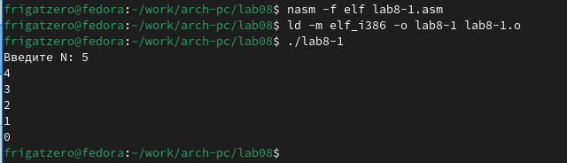{#fig:008 width=85%}

7. Создадим файл lab8-2.asm и введем в него текст программы из листинга 8.2. Создадим исполняемый файл и запустим его с заданными аргументами. В итоге были обработаны аргументы: аргумент1, аргумент, 2, 'аргумент 3'.

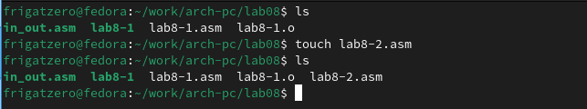{#fig:009 width=85%}

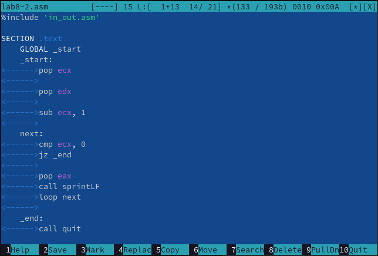{#fig:010 width=85%}

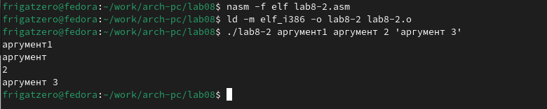{#fig:011 width=85%}

8. Создадим файл lab8-3.asm и введем в него текст листинга 8.3. Создадим исполняемый файл и проверим его работу, указав аргументы.

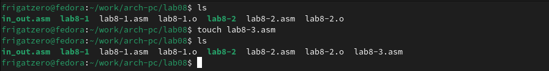{#fig:012 width=85%}

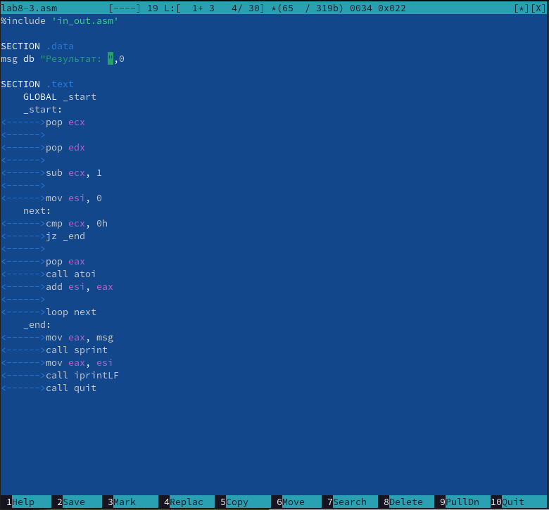{#fig:013 width=85%}

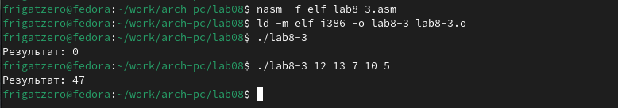{#fig:014 width=85%}

9. Изменим текст программы для вычисления произведения аргументов командной строки.

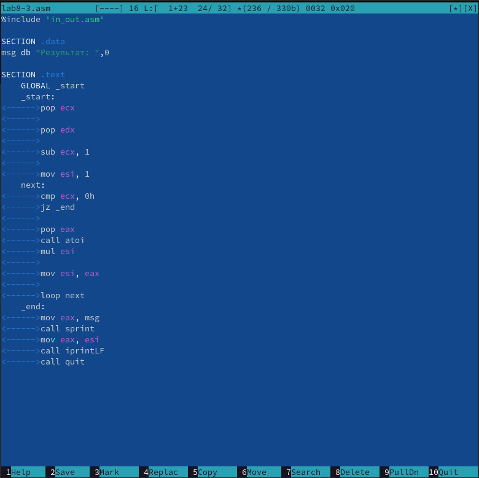{#fig:015 width=85%}

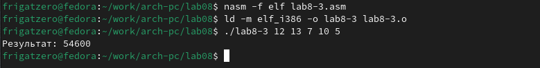{#fig:016 width=85%}
 
# Ход выполнения заданий для самостоятельной работы

1. Напишем программу для нахождения суммы значений функции для введенных в качестве аргумента программы значений x. Выберем значение функции из №18, табл. 7.5. Создадим исполняемый файл и проверим его работу

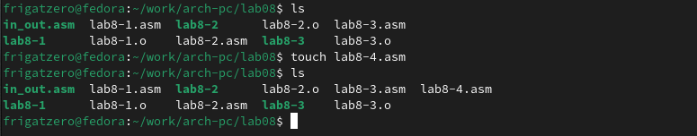{#fig:017 width=85%}

**Листинг 3.1** Программа для нахождения суммы значений функции для введенных x.
```assembly
%include 'in_out.asm'

SECTION .data
fun db 'Функция: f(x) = 17 + 5x',0
res db 'Результат: ',0

SECTION .bss
x resb 10

SECTION .text
    GLOBAL _start
    _start:
	;=[Выводим сообщение с функцией]
	mov eax, fun
	call sprintLF
	;
	
	;=[Извлекаем количество аргументов и имя программы с стека]
	pop ecx     ; Количество аргументов в <ecx>
	pop edx     ; Имя программы в <edx>
	sub ecx, 1  ; <ecx - 1> => кол-во аргументов без названия программы
	;
    main:
	;=[Сравниваем ecx с нулем]
	cmp ecx, 0 ; Если <ecx = 0>
	je _exit   ; Завершаем программу
	;
	
	;=[Забираем n-ый аргумент с стека]
	pop eax
	call atoi    ; конвертируем из кода символа в число
	;
	
	;=[Находим значение функции]
	mov edi, 5   ; <edi = 5>
	mul edi      ; <eax = 5x>
	add eax, 17  ; <eax = 17+5x>
	mov edi, eax ; <edi = eax>
	add [x], edi ; <x = x + edi>
	;
	
	loop main ; <ecx - 1>
    _exit:
	;=[Выводим сообщение 'Результат: <x>']
	mov eax, res
	call sprint
	mov eax, [x]
	call iprintLF
	;
	call quit
```

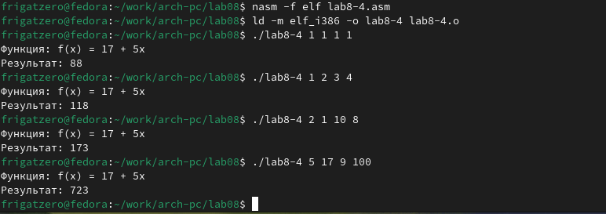{#fig:018 width=85%}

# Вывод

После выполнения заданий лабораторной работы и заданий для самостоятельной работы я приобрел навыки написания программ с использованием циклов и обработкой аргументов командой строки, научился работать с структурой данных стек и использовать регистр ecx для работы с циклами. 
